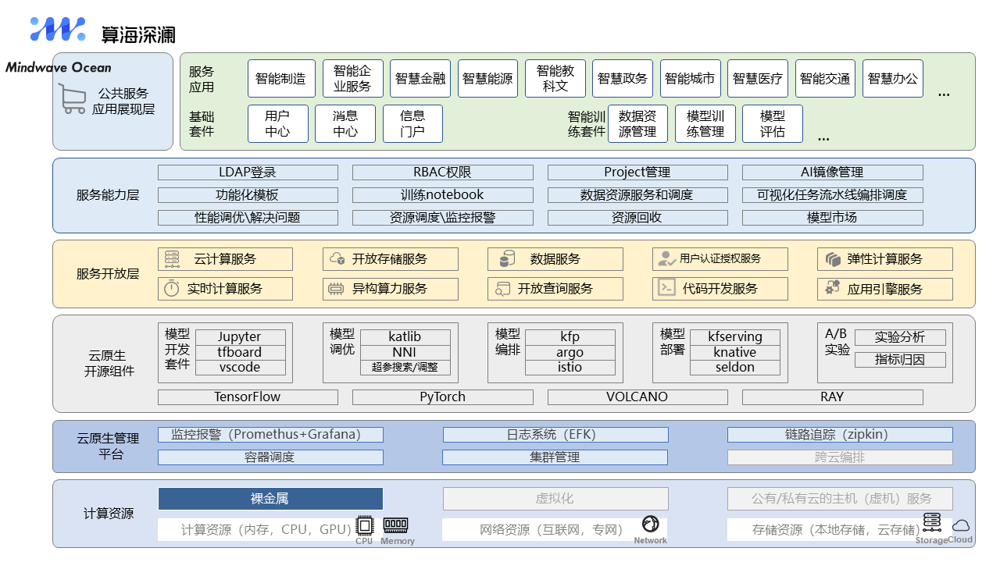

# MindcrestOcean

## 愿景
致力于快速实现部署、管理、监控以及自动化运维大数据云原生平台，帮助您快速构建起稳定、高效、可弹性伸缩的大数据云原生平台。

## MindcrestOcean是什么
算海深澜项目旨在开发一款基于国产GPU的大模型训练工具，致力于提升大模型训练的效率与性能，推动国产GPU技术在人工智能领域的广泛应用。通过打造高效、稳定、自主可控的训练工具，助力中国在AI技术领域实现核心突破，赋能千行百业的智能化升级。
“海”象征着宽广与包容，寓意以开放的心态拥抱技术的无限可能；“澜”则代表着波澜壮阔的力量与变革，彰显FusionX在国产GPU技术领域深耕的决心与潜力。

主要特性有:

* 快速部署,可快速完成300个节点的大数据集群部署
* 兼容复杂环境,极少的依赖使其很容易适配各种复杂环境
* 监控指标全面丰富，基于生产实践展示用户最关心的监控指标
* 灵活便捷的告警服务，可实现用户自定义告警组和告警指标
* 可扩展性强，用户可通过配置的方式集成或升级大数据组件

## 整体架构

## 集成组件

各集成组件均进行过兼容性测试，并稳定运行于300+个节点规模的大数据集群，日处理数据量约4000亿条。在海量数据下，各大数据组件调优成本低，平台默认展示用户关心和需要调优的配置。

| 序号 |       名称        |  版本  |                       描述                       |
| :--: | :---------------: | :----: | :----------------------------------------------: |
|  1   |       HDFS        | 3.3.3  |                 分布式大数据存储                 |
|  2   |       YARN        | 3.3.3  |             分布式资源调度与管理平台             |
|  3   |     ZooKeeper     | 3.5.10 |                  分布式协调系统                  |
|  4   |       FLINK       | 1.15.2 |                   实时计算引擎                   |
|  5   | DolphoinScheduler | 3.1.1  |      分布式易扩展的可视化工作流任务调度平台      |
|  6   |    StreamPark     | 1.2.3  | 流处理极速开发框架,流批一体&湖仓一体的云原生平台 |
|  7   |       Spark       | 3.1.3  |                  分布式计算系统                  |
|  8   |       Hive        | 3.1.0  |                   离线数据仓库                   |
|  9   |       Kafka       | 2.4.1  |          高吞吐量分布式发布订阅消息系统          |
|  10  |       Trino       |  367   |             分布式Sql交互式查询引擎              |
|  11  |       Doris       | 1.1.5  |            新一代极速全场景MPP数据库             |
|  12  |       Hbase       | 2.4.16 |               分布式列式存储数据库               |
|  13  |      Ranger       | 2.1.0  |                   权限控制框架                   |
|  14  |   ElasticSearch   | 7.16.2 |                  高性能搜索引擎                  |
|  15  |    Prometheus     | 2.17.2 |           高性能监控指标采集与告警系统           |
|  16  |      Grafana      | 9.1.6  |             监控分析与数据可视化套件             |
|  17  |   AlertManager    | 0.23.0 |                 告警通知管理系统                 |

